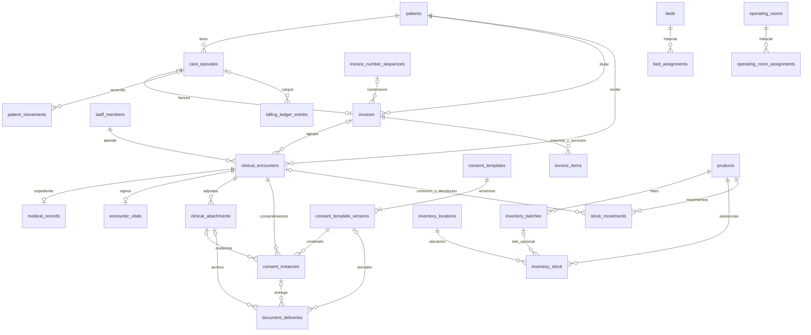

# Modelo de datos y normalización

Estado: 30 de septiembre de 2026, rama `Beta-v0.0.1`. El esquema de Drizzle
contiene **54 tablas tenant y una tabla global (`companies`)**. Las bases locales
configuradas, `sicmh` y `medit_global`, se reconstruyeron sobre el MySQL existente.
Se descartaron los datos anteriores por autorización del usuario.

## Correcciones realizadas

| Área | Resolución | Protección |
| --- | --- | --- |
| Relaciones incompletas | Episodio anterior, movimiento de un cargo, atención/cama/quirófano de un movimiento tienen FK. | MySQL rechaza referencias inexistentes. |
| Propiedad del paciente | Se comprueba la misma identidad entre episodio, factura, atención, movimiento, cargo, asignación y adjunto cuando se vinculan. | Claves foráneas compuestas con `patient_id`. |
| Atención y episodio | La atención llega al episodio por su factura. Se eliminó `clinical_encounters.care_episode_id`. | Se elimina la ruta duplicada que podía apuntar a otro episodio. |
| Pago del episodio | Se eliminó `care_episodes.status`. La respuesta de la API consulta `invoices.status`. | El pago tiene una sola fuente. `closed_at` conserva el cierre del episodio. |
| Ocupación | `beds.status` y `operating_rooms.status` guardan disponible/mantenimiento/bloqueado. La API obtiene `occupied` de la asignación vigente. | Índices únicos por recurso y por paciente cuando `released_at` y `deleted_at` son NULL. |
| Asignaciones | No se reemplaza al paciente de una asignación histórica; primero debe liberarse. Se valida disponibilidad operativa. | Transacción, bloqueo previo a lectura, índices únicos y validación de la API. |
| Inventario | Los lotes guardan identidad y fechas; su saldo está únicamente en `inventory_stock`, por producto, ubicación y lote. | Unicidad con columna generada para incluir existencias sin lote; FK lote/producto; cantidad no negativa. |
| Movimientos de inventario | Transferencias, consumos, devoluciones y ajustes escriben `stock_movements` y saldo en una transacción. | Bloqueo por producto. Consumo por caducidad próxima, excluyendo lotes vencidos. |
| Devolución clínica | Una reducción de insumos devuelve a los lotes y ubicaciones registrados en los consumos de esa atención. | No puede devolverse más que el saldo consumido pendiente de devolución. |
| Facturación | Las correcciones de cantidades respetan el precio de la línea original. El CAI asignado se conserva. | Cantidades positivas, importes coherentes por línea, descuentos de 0 a 100 y transacciones para cargos y total. |
| Consentimientos | Se deriva el paciente desde la atención. Cada impresión/aceptación electrónica crea una instancia; una firma física solo completa una instancia pendiente. | Historial conservado, versión válida de la plantilla, adjunto de la misma atención y estados de aceptación coherentes. |
| Entregas | Se referencia el adjunto, la instancia de consentimiento o la versión exacta del borrador, según corresponda. | CHECK del tipo de documento y referencias; SHA-256 de los PDF generados; estado y terminación HTTP coherentes. |
| Recursos de citas | Se conservan FK directas a cama o quirófano. | No se permiten ambos a la vez; la fecha final debe ser posterior a la inicial. |
| Escrituras concurrentes | Los repositorios que reciben un conjunto de registros bloquean antes de cargarlo y guardan en la misma transacción. | `aggregate_locks` coordina estos flujos por tenant. Los registros no retirados ya no se marcan eliminados antes de guardarse. |

## Esquema principal



El diagrama muestra las relaciones principales. El detalle completo y las
restricciones están en `src/infrastructure/database/schema/tenant.ts`; las
relaciones de consulta están en `schema/relations.ts`.

## Datos conservados deliberadamente

El diseño mantiene datos históricos y algunas redundancias controladas; no se
presenta como una demostración de tercera forma normal estricta de todas las tablas:

- Precios, descripciones, descuentos, CAI y firmante describen una operación
  histórica. No se recalculan a partir de catálogos que pueden cambiar.
- `inventory_stock` guarda el saldo operativo y `stock_movements` registra sus
  cambios. El backend actualiza ambos dentro de la misma transacción. Escrituras
  manuales de saldo fuera de esos flujos no generan movimientos automáticamente.
- `invoices.amount` conserva el importe acumulado del contrato actual, compuesto
  por insumos y cargos del libro auxiliar. Se actualiza con ellos en la misma
  transacción. No debe sumarse nuevamente al detalle al calcular un cobro.
- Algunas entidades admiten existir sin factura o sin atención, como adjuntos de
  paciente y movimientos. Conservan su titular; al vincularlas, las FK compuestas
  impiden mezclar pacientes.
- El personal del consentimiento identifica al profesional de su emisión, aunque
  cambie posteriormente el responsable de la atención.
- Los detalles JSON de auditoría son contexto histórico de eventos; no sustituyen
  entidades operativas ni sus relaciones.

`historia_medica.isActive` se representa mediante
`clinical_encounters.deleted_at`: NULL es vigente y una fecha indica borrado lógico.
El expediente y los signos se consultan a través de la atención vigente.

## Transacciones y compatibilidad

`TenantContext.transaction` comparte la transacción Drizzle con los repositorios
invocados por un servicio. Crear una visita incluye factura, atención, expediente,
insumos, episodio y recorrido; si falla alguno, se revierte la operación.

Los flujos de visitas, cobros y asignaciones usan un bloqueo por tenant mientras
subsistan interfaces que cargan conjuntos completos. Evita actualizaciones perdidas,
a costa de serializar esas escrituras. No se ha realizado una prueba de carga de
producción; sustituir esas interfaces por operaciones sobre registros concretos
permitirá aumentar la concurrencia sin debilitar las garantías actuales.

El inventario usa UUID para productos y ubicaciones. Se conservan los nombres de
campos de respuesta de la API y se admiten los selectores de ubicación `main`,
`outpatient`, `emergency`, `operating_room` y sus alias `1`, `2`, `3`, `4`.
`prodQty` en edición ajusta únicamente la ubicación indicada (`subinvId`, por defecto
el almacén general); no sobrescribe las existencias de otras ubicaciones.

## Reconstrucción y validación

Las migraciones son:

1. `0000_same_wind_dancer.sql`: esquema inicial.
2. `0001_restore_reported_tables.sql`: tablas reportadas, auditoría, tokens y SAR.
3. `0002_normalize_integrity.sql`: normalización, propiedad del paciente,
   asignaciones y lotes.
4. `0003_document_integrity.sql`: identidad y evidencia de documentos,
   consistencia de entregas y líneas de factura.

Los cambios destructivos de normalización se validaron desde una base vacía.
No constituyen una migración con preservación de datos de una instalación antigua.

Para repetir el borrado autorizado en desarrollo:

```sh
npm run db:reset:local -- --confirm-delete-local-data
```

El comando se limita al servidor local, valida los nombres configurados, rechaza
bases de sistema y no borra el registro global si contiene otros tenants.
Reconstruye las mismas bases, aplica todas las migraciones y ejecuta el seed.
No crea contenedores ni volúmenes adicionales.

El seed conserva únicamente empresa, roles, permisos y sus relaciones, medios de
pago, tipos/estados/orígenes de citas, ubicaciones de inventario y servicio Consulta.
No crea pacientes, expedientes, productos, facturas, usuarios ni una serie SAR real.
Los bloqueos técnicos se crean al utilizar los flujos correspondientes.

```sh
npm run type-check
npm test
npm run test:mysql
npm run db:generate:tenant
```

Las pruebas MySQL utilizan el tenant local sin tráfico concurrente, crean datos
con UUID y los retiran al terminar. Prueban integridad de referencias, concurrencia,
rollback entre repositorios, visita completa y edición, saldos por lote y ubicación,
precios históricos, consentimientos, tokens y series SAR. La generación debe
informar que el esquema no tiene diferencias pendientes.

Las pruebas de consentimientos sustituyen el renderizador PDF para probar la
persistencia. No certifican la impresión física, correo, almacenamiento GCS ni el
flujo visual del frontend. El alcance de auditoría y entrega HTTP está documentado
en [el cuadro de tablas reportadas](reported-tables-resolution.md).
